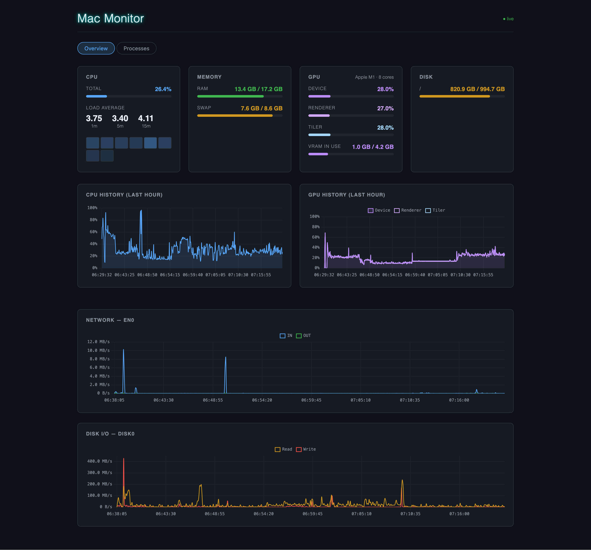

# Mac Monitor

A lightweight system monitor for macOS servers. Collects CPU, memory, GPU, disk, and network metrics at 5-second intervals, stores them for a configurable period (1 day by default), and exposes a web UI for both live and historical inspection.



**Design constraint:** Mac Monitor must not add noticeable cost (CPU, GPU, wakeups, disk) while running in the background. With the dashboard open a little more is acceptable, but keep it low. Background work must not spawn processes, and anything periodic should be measured (e.g. `top -l 2 -s 60 -pid <pid> -stats pid,cpu,idlew`).

## Running

```bash
# Development (Go server on :8080, Vite dev server on :5173)
make dev

# Production
make build        # builds web/dist then compiles the binary
./mac-monitor     # serves everything on http://localhost:8080
```

The binary embeds the compiled frontend. The database (`mac-monitor.db`) and settings (`config.json`) live in `~/Library/Application Support/Mac Monitor/` (for the sandboxed App Store build, under `~/Library/Containers/<bundle id>/Data/` instead). `config.json` is created with defaults on first run:

```json
{
  "retention": "1d",
  "alerts": {
    "native": true,
    "command": "",
    "repeat": "1d",
    "cpu": { "percent": 80, "duration": "5m", "ignore": [] },
    "disk": { "warn_percent": 90, "critical_percent": 95 }
  }
}
```

Durations accept Go syntax (`90s`, `12h`) or days (`7d`). Restart to apply changes; old data is pruned and the file compacted at startup.

## Alerts

- **CPU:** a process using more than `cpu.percent` of one core (as in Activity Monitor) for `cpu.duration`. It clears when the process drops below half that. Processes in `cpu.ignore` are never reported; add to the list from the notification ("Don't Alert for This App") or the Alerts tab. Only processes owned by the current user can be measured.
- **Disk:** used space at `warn_percent` / `critical_percent`, with 2 points of hysteresis. Set a value to 0 to disable it.

You are notified when an alert starts or escalates, and again every `repeat` while it stays active. Alert state is stored in the database, so restarts don't re-notify.

Delivery channels:
- `native`: macOS notifications (Notification Center). Outside an app bundle, `osascript` is used.
- `command`: run with `/bin/sh -c`. Details come in `MM_ALERT_KEY`, `MM_ALERT_KIND`, `MM_ALERT_SUBJECT`, `MM_ALERT_LEVEL` (`warning`/`critical`), `MM_ALERT_TITLE`, `MM_ALERT_BODY`, `MM_ALERT_ATTEMPT`, and as JSON on stdin. Exit status 0 counts as delivered. For example, `curl -fsS -d "$MM_ALERT_BODY" ntfy.sh/my-topic`.

Failed deliveries are retried after 1 min, 5 min, 15 min, 1 h and 3 h, then marked failed. The Alerts tab shows each delivery's status and last error.

## Architecture

```
┌─────────────────────────────────┐
│  Collector goroutines (5s tick) │
│  CPU · Memory · GPU · Disk · Net│
└──────────────┬──────────────────┘
               │
               ▼
        ┌─────────────┐
        │  SQLite DB  │  mac-monitor.db
        └──────┬──────┘  rolling retention (config.json)
               │
               ▼
     ┌──────────────────┐
     │   HTTP server    │  :8080
     │  REST + WebSocket│
     └────────┬─────────┘
              │
              ▼
    ┌──────────────────┐
    │  Vite + CrankJS  │  SPA
    │  Live + history  │
    └──────────────────┘
```

### Go packages

| Path                  | Responsibility                                                                                                                                                                                         |
| --------------------- | ------------------------------------------------------------------------------------------------------------------------------------------------------------------------------------------------------ |
| `cmd/mac-monitor/`    | Entrypoint. Wires together the collector, storage, alerts, and HTTP server.                                                                                                                            |
| `internal/collector/` | Metric collection via [gopsutil](https://github.com/shirou/gopsutil) and cgo. One file per domain: `collector.go` (Snapshot struct + orchestration), `gpu.go` (IOKit), `disk.go`, `proccpu.go`.        |
| `internal/alerts/`    | Alert rules (CPU, disk), alert state, and the notification delivery queue.                                                                                                                             |
| `internal/notify/`    | macOS notifications (`UNUserNotificationCenter`, osascript fallback).                                                                                                                                  |
| `internal/config/`    | Loads `config.json` from the data directory (created with defaults on first run).                                                                                                                       |
| `internal/storage/`   | SQLite via [modernc.org/sqlite](https://pkg.go.dev/modernc.org/sqlite) (pure Go, no CGo). Schema migration using `addColumnIfMissing` so new columns can be added without breaking existing databases. |
| `internal/server/`    | `net/http` server with a WebSocket hub for live metric streaming. Historical data served via `/api/history?from=&to=&step=` (`step` > 1 buckets rows server-side).                                                                                 |

### Frontend

Built with [Vite](https://vitejs.dev/) and [CrankJS](https://crank.js.org/). CrankJS uses generator functions as components — the `for (props of this)` loop pattern is how components receive prop updates, and `this.flush()` must be called **inside** that loop (not before it) for effects like Chart.js updates to run on every render.

| File                                 | Responsibility                                                                         |
| ------------------------------------ | -------------------------------------------------------------------------------------- |
| `web/src/App.jsx`                    | Root component. Owns the WebSocket connection, visible time range, history fetching, and top-level layout.   |
| `web/src/components/LineChart.jsx`   | Chart.js line chart on a linear time axis. Accepts `datasets`, `xMin`/`xMax`, `onView`, `yMax`, and `formatY` props; handles zoom and pan. |
| `web/src/components/MetricGauge.jsx` | Horizontal progress bar for a single metric (works with both percentages and bytes).   |
| `web/src/components/GpuCard.jsx`     | GPU utilization and memory (read from IOKit's `IOAccelerator` entries).                |
| `web/src/components/AlertsPanel.jsx` | Alerts tab: active/recent alerts, delivery status, CPU ignore list.                    |
| `web/src/components/DiskCard.jsx`    | Disk space per user-facing volume (filters out internal APFS system volumes).          |

### Data flow

1. A ticker goroutine calls `collector.Collect()` every 5 seconds, which gathers all metrics into a `Snapshot` struct.
2. The snapshot is written to SQLite and broadcast to all connected WebSocket clients.
3. The frontend fetches the visible time range from `GET /api/history`. Short ranges use raw samples and append live snapshots from the WebSocket feed; longer ranges pass `step` so the server returns one averaged snapshot per bucket. Charts plot real timestamps and break the line where samples are missing. Network and disk I/O rates are computed client-side as deltas between consecutive snapshots.

### Adding a new metric

1. Add fields to `collector.Snapshot` in `internal/collector/collector.go`.
2. Collect the data (new file in `internal/collector/` if it warrants one).
3. Add a column to the `CREATE TABLE` statement in `internal/storage/storage.go` **and** add the same column to the `addColumnIfMissing` loop so existing databases are migrated automatically.
4. Update `Insert`, `Query`, and `Latest` to include the new column.
5. Add a component or extend an existing one in `web/src/components/`.

### GPU monitoring note

GPU metrics are read from the IORegistry (`IOAccelerator` → `PerformanceStatistics`) via cgo, the same data `ioreg -rc IOAccelerator` prints. This does not require `sudo`. It used to shell out to `ioreg`, which cost about 23 ms of CPU per sample.

Temperature monitoring was explored but removed: on macOS 15+, Apple removed CPU/GPU die temperatures from the `powermetrics` sampler output. Direct SMC access via IOKit (CGo) would be required — left as a future improvement.
